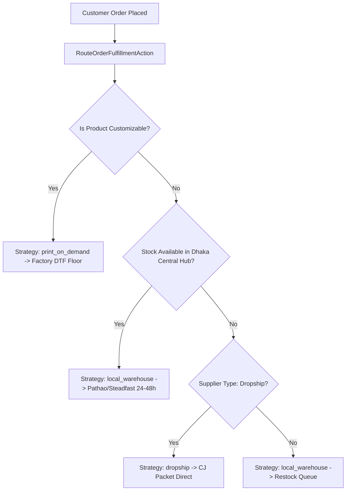

# Alibaba B2B Procurement & Hybrid Sourcing Architecture

## Overview
CommerceOS powers a unified **Hybrid Sourcing Engine** that balances local Dhaka warehouse stock, print-on-demand factory jobs, CJ international dropshipping, and large-scale Alibaba B2B bulk fabric & blanks procurement.

---

## 1. Alibaba Global B2B Provider (`AlibabaProvider`)

- **Role**: Bulk blank apparel, textile rolls (combed cotton, French Terry, drop-shoulder silhouettes), and custom manufacturing quotes.
- **Minimum Order Quantities (MOQ)**: Enforces factory MOQ tiers (e.g., 50–100 pcs for custom dyed blanks, 200–500 pcs for fabric rolls).
- **Volume Tiers**:
  - Tier 1: Sample to base MOQ (e.g., 100 pcs @ $6.50/pc)
  - Tier 2: Mid-volume (e.g., 500 pcs @ $5.20/pc)
  - Tier 3: Container batch (e.g., 1,000+ pcs @ $4.40/pc)
- **Trade Assurance & Customs Logistics**:
  - Payment Terms: 30% Milestone Deposit upon PO issuance, 70% Pre-Shipment balance.
  - Sea Freight Port of Entry: Chittagong Sea Port (BDCGP) with 18–24 days ocean transit.
  - Air Cargo Alternative: Dhaka Hazrat Shahjalal International Airport (DAC) with 5–8 days transit.
  - Bangladesh Import Duty & Advance Income Tax (AIT): Factored at 15% landed markup.

---

## 2. Hybrid Sourcing Decision Engine (`RouteOrderFulfillmentAction`)

When a customer places an order on Nazeefa, every line item is automatically inspected by the routing pipeline:

### Split Shipment Handling
When a single customer cart contains both a local warehouse garment and an international dropship or custom POD piece:
- The order is marked with `is_split_shipment = true` and `fulfillment_strategy = 'hybrid'`.
- The local piece is dispatched immediately from the central hub via Pathao/Steadfast so the customer does not suffer unnecessary delays.
- The POD or dropship component tracks with an independent fulfillment job and tracking identifier.

---

## 3. Automated PO Warehouse Intake

When a B2B Purchase Order status advances to `received`:
- All linked `product_variant_id` lines automatically execute `AdjustInventoryAction` into `WH-DHK-CENTRAL`.
- Stock quantities are incremented on the double-entry `stock_movements` ledger with reason code `purchase_order_intake`.
